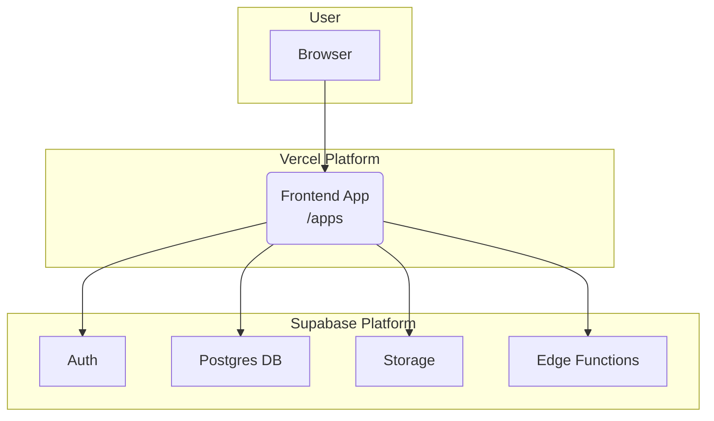

```markdown
<!-- agent-update:start:architecture-notes -->
# Architecture Notes

This document describes the high-level architecture of the system, its core components, and the key technical decisions that shape its design. The system is built as a modular monorepo, leveraging a Backend-as-a-Service (BaaS) provider for its backend infrastructure.

## System Architecture Overview

The system follows a **modular monorepo** architecture, managed with **Bun**. The core topology is based on the **Jamstack** principles, separating the frontend presentation layer from the backend data and logic layer.

-   **Topology:** A collection of frontend applications (`apps/`) consumes backend services provided by **Supabase**. Shared logic, UI components, and types are managed in a central `packages/` directory.
-   **Deployment Model:** Frontend applications are deployed to a hosting platform like **Vercel**, which provides a global CDN, CI/CD, and serverless function execution. The backend is fully managed by Supabase.
-   **Request Flow:** A typical user request flows from the browser to the Vercel-hosted frontend application. The client-side application then interacts directly with Supabase APIs (e.g., for authentication, data queries, or invoking edge functions) to fetch or manipulate data.

## Core System Components

The repository is organized into several key directories that represent distinct parts of the system.

-   **`apps/`**: Contains the standalone frontend applications. Each subdirectory within `apps/` is a separate project, such as a web dashboard or a public-facing website. These apps are the primary entry points for users.
-   **`packages/`**: A collection of shared libraries used across different applications in the monorepo. This promotes code reuse and consistency for things like UI components, utility functions, API clients, and TypeScript types.
-   **`supabase/`**: The heart of the backend. This directory contains all configuration for the Supabase project, including:
    -   Database migrations and schema definitions (`supabase/migrations`).
    -   Serverless Edge Functions (`supabase/functions`).
    -   Database seeding scripts.
-   **`monitoring/`**: Holds configuration files for observability and monitoring tools. This may include setup for logging, error tracking (e.g., Sentry), or performance metrics dashboards.
-   **`tests/`**: Dedicated to end-to-end (E2E) or integration tests that span multiple parts of the system (e.g., testing a full user flow from the frontend UI to the backend database).
-   **`docs/`**: Project documentation, including this file.
-   **`scripts/`**: Contains automation and utility scripts for tasks like database management, CI/CD helpers, or code generation.
-   **`12-weeks-transformation/`**: A project-specific directory, likely containing materials, plans, or code related to a focused initiative or a guided program. It may exist outside the core application's runtime architecture.

## Internal System Boundaries

-   **Frontend/Backend Seam:** The primary boundary exists between the client-side applications in `apps/` and the Supabase backend. Communication occurs exclusively over HTTPS via the Supabase client library or direct API calls.
-   **Data Ownership:** All application data is owned and managed by the PostgreSQL database within Supabase. The schema, defined in `supabase/migrations`, serves as the single source of truth for the data model.
-   **Shared Contracts:** Cross-component contracts are enforced through shared TypeScript types defined in `packages/`. This ensures that both the frontend and backend functions operate on the same data structures.

## System Integration Points

-   **Inbound Interfaces:**
    -   **Web Applications (`apps/`)**: The main user-facing interfaces, hosted on Vercel.
    -   **Supabase API Gateway**: Supabase exposes several APIs that the frontend consumes:
        -   **PostgREST API**: For direct, secure access to the PostgreSQL database.
        -   **Auth API**: For user authentication and management.
        -   **Storage API**: For managing files and assets.
        -   **Edge Functions**: For custom server-side logic.
-   **Orchestration:** Orchestration is primarily driven by the frontend. The client-side applications coordinate calls to various Supabase services to fulfill user actions. Complex, multi-step backend logic is encapsulated within Supabase Edge Functions.

## External Service Dependencies

-   **Supabase (Core Backend):** Provides the database (Postgres), authentication, file storage, and serverless compute (Edge Functions).
    -   *Authentication:* JWT-based.
    -   *Considerations:* System availability is directly tied to Supabase's uptime. Performance and rate limits are dependent on the selected Supabase pricing plan.
-   **Vercel (Inferred from `vercel.json`):** The primary platform for hosting, building, and deploying the frontend applications.
    -   *Considerations:* Deployment success and frontend performance are dependent on the Vercel platform.
-   **Monitoring Service (Inferred from `monitoring/`):** A third-party platform (e.g., Sentry, Grafana, Datadog) for application monitoring, error tracking, and logging.

## Key Decisions & Trade-offs

-   **Monorepo Strategy:** The decision to use a monorepo simplifies dependency management and promotes code sharing between applications. The trade-off is increased complexity in the build and CI/CD pipeline, which is mitigated by using a fast toolchain like `bun`.
-   **Backend-as-a-Service (BaaS) with Supabase:** Opting for Supabase significantly accelerates development by outsourcing backend infrastructure management. This allows the team to focus on application features. The trade-off is a degree of vendor lock-in and potential constraints compared to a fully custom backend.
-   **Jamstack Architecture:** This choice prioritizes performance, security, and scalability by decoupling the frontend from the backend. The trade-off is that real-time functionality can be more complex to implement, often requiring WebSockets or server-sent events, which can be managed via Supabase's real-time capabilities.

## Diagrams

Here is a simplified diagram illustrating the system architecture.



## Risks & Constraints

-   **Supabase Dependency:** The system's uptime, performance, and feature set are tightly coupled to the Supabase platform. Any outage or limitation in Supabase directly impacts the application.
-   **Database Scaling:** While serverless components scale horizontally, the PostgreSQL database is a potential bottleneck. Careful schema design, query optimization, and appropriate instance sizing are critical for long-term scalability.
-   **Vendor Lock-in:** Migrating the backend away from Supabase to a different provider or a self-hosted solution would be a significant and costly undertaking due to the deep integration.

<!-- agent-readonly:guidance -->
## AI Update Checklist
1. Review ADRs, design docs, or major PRs for architectural changes.
2. Verify that each documented decision still holds; mark superseded choices clearly.
3. Capture upstream/downstream impacts (APIs, events, data flows).
4. Update Risks & Constraints with active incident learnings or TODO debt.
5. Link any new diagrams or dashboards referenced in recent work.

<!-- agent-readonly:sources -->
## Acceptable Sources
- ADR folders, `/docs/architecture` notes, or RFC threads.
- Dependency visualisations from build tooling or scripts.
- Issue tracker discussions vetted by maintainers.

## Related Resources
- [Project Overview](./project-overview.md)
- Update [agents/README.md](../agents/README.md) when architecture changes.

<!-- agent-update:end -->
```
