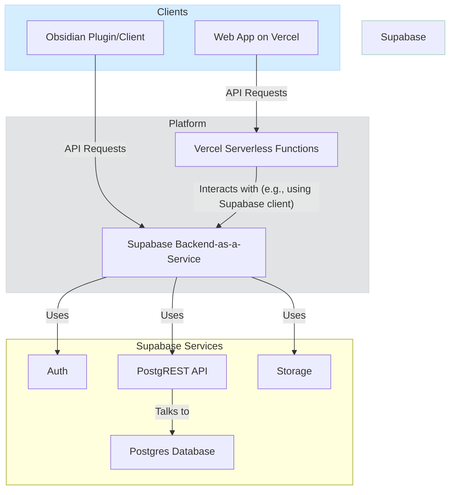

```markdown
<!-- agent-update:start:data-flow -->
# Data Flow & Integrations

This document explains how data enters, moves through, and exits the system, including interactions with our primary backend services and hosting platforms. The core of our architecture revolves around applications hosted on Vercel interacting with a Supabase backend.

## High-level Flow

The primary data pipeline begins with a user interacting with a client application. This client can be a web application running in the browser or a desktop utility. The client sends requests to our backend services, which process the data and persist it in our central database.

Here is a simplified visualization of the flow:



## Internal Movement

Within the repository, the primary interaction is between the applications defined in `apps/` and the shared libraries in `packages/`.

-   **`apps/`**: Contains discrete, deployable applications (e.g., a Next.js web app). These applications contain the user-facing UI and route-specific backend logic (API routes or server components).
-   **`packages/`**: Contains shared code consumed by the applications. This includes:
    -   **UI Components**: Reusable React components.
    -   **Shared Types**: TypeScript interfaces for consistent data shapes (e.g., API payloads, database models).
    -   **Data Access Logic**: A centralized Supabase client wrapper or data-fetching hooks (`@tanstack/react-query`) that standardize how applications communicate with the Supabase backend.
-   **Communication**: Data moves between these internal modules primarily through function calls and module imports within the monorepo structure. During runtime, a client-side application in `apps/` might use a data-fetching hook from `packages/` to call a Vercel serverless function, which in turn uses a Supabase client from `packages/` to query the database.

## External Integrations

Our system relies on several key external services to function.

**Supabase — Backend Platform**
-   **Purpose**: Serves as our primary backend, providing database, authentication, file storage, and serverless functions. It offers a comprehensive suite of tools that we access via its client libraries.
-   **Authentication**: We use Supabase Auth to manage user identities. It handles sign-up, login, and session management using JSON Web Tokens (JWTs). The client-side applications are responsible for storing these tokens securely and passing them in the `Authorization` header for authenticated requests.
-   **Payload Shapes**: Data interaction happens primarily through the auto-generated PostgREST API, which exposes our Postgres tables as RESTful endpoints. Payloads are JSON objects that conform to the table schemas. The shared types in `packages/` help ensure type safety.
-   **Retry Strategy**: The official `supabase-js` client library handles basic network reliability. For data-fetching operations, we use libraries like TanStack Query which provide configurable retry logic, caching, and request deduplication.

**Vercel — Hosting & Serverless Environment**
-   **Purpose**: Vercel is our deployment platform for frontend applications and serverless functions defined in the `apps/` directory. It handles continuous deployment, scaling, and provides the execution environment.
-   **Authentication**: Vercel services are protected by environment variables containing secure keys (e.g., the Supabase service role key) needed to communicate with the backend. It does not handle user authentication itself but executes code that validates JWTs passed from the client.
-   **Data Flow**: Vercel routes incoming HTTP requests to the appropriate serverless function or static asset. These functions then execute our application logic, often by initializing the Supabase client and performing database operations.

**Obsidian Client (`obsreview.exe`)**
-   **Purpose**: Based on the executable names (`obsidian-note-reviewer.exe`, `obsreview.exe`), this appears to be a desktop client or plugin for the Obsidian note-taking application. Its purpose is likely to sync notes or review items between the local Obsidian vault and our Supabase database.
-   **Authentication**: This client would authenticate with Supabase Auth using the same mechanisms as the web app, likely using an email/password or OAuth flow to obtain a JWT.
-   **Payload Shapes**: The client would send and receive data (e.g., note content, metadata) in JSON format to and from the Supabase API endpoints.

## Observability & Failure Modes

-   **Monitoring**:
    -   **Vercel**: Provides built-in logging and analytics for all deployments. We can inspect serverless function logs, invocation details, and performance metrics directly from the Vercel dashboard.
    -   **Supabase**: The Supabase dashboard offers logs for API requests, Postgres query performance analysis, and Auth events.
    -   **`monitoring/`**: This directory is reserved for any future custom monitoring configurations, such as setting up a third-party logging service or defining custom health checks.
-   **Failure Modes & Mitigation**:
    -   **Downstream API Failure (Supabase)**: If the Supabase API is unavailable or returns an error, our client-side applications use TanStack Query's retry mechanisms with exponential backoff to attempt the request again. Persistent failures are surfaced to the user with an error message.
    -   **Vercel Function Timeout**: If a serverless function exceeds its execution limit, Vercel will terminate it. This is mitigated by optimizing database queries and any long-running operations within the function. For longer jobs, the architecture would need to be updated to use a queue-based system with background workers (e.g., using Supabase Edge Functions with a message queue).
    -   **Authentication Errors**: Invalid or expired JWTs result in a `401 Unauthorized` response from Supabase. The client application is responsible for catching this error and prompting the user to log in again.

<!-- agent-readonly:guidance -->
## AI Update Checklist
1. Validate flows against the latest integration contracts or diagrams.
2. Update authentication, scopes, or rate limits when they change.
3. Capture recent incidents or lessons learned that influenced reliability.
4. Link to runbooks or dashboards used during triage.

<!-- agent-readonly:sources -->
## Acceptable Sources
- Architecture diagrams, ADRs, integration playbooks.
- API specs, queue/topic definitions, infrastructure code.
- Postmortems or incident reviews impacting data movement.

<!-- agent-update:end -->
```
