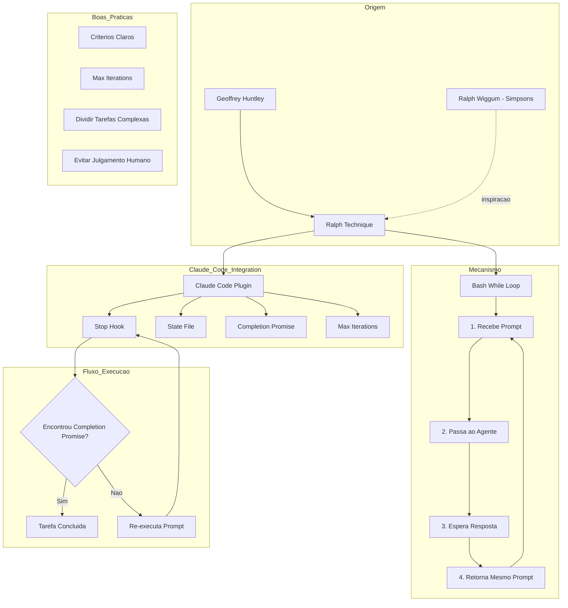

> [!info]+ Detalhes do Video do Youtube
> **Assistir:** [The Bizarre Anthropic Plugin That Every Developer Is Missing](https://youtu.be/ny_BAA3eYaI)
> **Duracao:** 04:24
> **Mentor:** Geoffrey Huntley
> **Canal:** Better Stack
> **Publicado:** 2025-12-30

> [!tip]- Lexico
> - **Ralph Wiggum Technique**: Tecnica de loop infinito que executa o mesmo prompt repetidamente ate a conclusao
> - **Stop Hook**: Hook do Claude Code que executa quando uma tarefa termina
> - **Completion Promise**: Sinal de conclusao ("complete" ou "done") que indica quando parar o loop
> - **Max Iterations**: Limite de iteracoes para evitar loops infinitos e custos excessivos
> - **State File**: Arquivo de estado criado para rastrear o progresso do loop

> [!target]- Principais Pontos do Video
> 1. **Origem**: Jeffrey Huntley (auto-intitulado "goat farmer") criou a tecnica Ralph
> 2. **Mecanismo**: Loop bash infinito que alimenta o agente com o mesmo prompt ate conclusao
> 3. **Integracao Anthropic**: Equipe transformou o conceito em plugin oficial do Claude Code
> 4. **Casos de Sucesso**: MVP por $300 vs $50k terceirizado, 6 repos overnight em hackathon YC
> 5. **Boas Praticas**: Usar criterios claros, iteracoes maximas, dividir tarefas complexas

> [!file-text]- Transcricao Completa do Video
>
> **00:00 - 00:19**
> Este e Ralph Wigum, provavelmente o personagem mais burro dos Simpsons, que se tornou a inspiracao para um engenhoso plug-in do Claude's Code, projetado para executar o mesmo comando repetidamente ate que ele seja concluido, mesmo que continue falhando. Ingenuidade e persistencia implacavel.
>
> **00:15 - 00:44**
> Ideal para modelos preguicosos que desistem muito cedo e nao terminam a tarefa. Mas por que a Anthropic criou isso? E isso nao vai custar muito dinheiro, ja que esta executando o mesmo comando repetidamente? Vamos descobrir. E antes de comecarmos, nao se esqueca de se inscrever. Antes de explicar como usar o Ralph com o codigo Claude, voce precisa entender de onde surgiu a ideia, porque e bem peculiar.
>
> **00:39 - 01:03**
> Jeffrey Huntley, um criador de cabras que, na minha opiniao, nao e realmente um criador de cabras, mas isso nao vem ao caso, criou uma tecnica no inicio deste ano que ele chamou de Ralph. Essa tecnica e basicamente um loop infinito do tipo bash while que recebe um comando, o passa para um agente, espera pela resposta e, em seguida, retorna ao agente exatamente o mesmo comando.
>
> **00:58 - 01:19**
> Entao, veja como e executar um prompt com AMP e veja como e usa-lo com codigo clawed. E simples, mas muito poderoso, porque se voce fornecer ao agente criterios de conclusao claros e um sinal de conclusao, voce pode essencialmente deixa-lo rodando durante a noite e acordar com a tarefa concluida.
>
> **01:15 - 02:17**
> Jeff falou sobre essa tecnica em uma palestra e um engenheiro a utilizou com varios agentes para entregar, revisar e testar um MVP por menos de US$ 300, enquanto que contratar um profissional terceirizado teria lhe custado US$ 50.000. E durante um hackathon da YC, a equipe de espelhamento de repositorios usou a ferramenta para enviar seis repositorios diferentes da noite para o dia, um dos quais era uma reescrita completa do uso do navegador, migrando de Python para TypeScript, o que deixou o fundador muito satisfeito. Tambem foi usado para criar uma linguagem de programacao totalmente nova do zero em menos de 3 meses.
>
> **02:14 - 02:35**
> Mas se voce pensa que a equipe da Anthropic escreveu um script bash de uma linha e o transformou em um plug-in, voce esta muito enganado, porque a equipe trabalhou bastante para integra-lo adequadamente ao codigo do Claude. O funcionamento e o seguinte: voce digita o comando Ralph slash, fornece o prompt na promessa de conclusao, que pode ser complete ou done, e tambem pode adicionar uma iteracao maxima.
>
> **02:32 - 02:55**
> Essas informacoes sao usadas para criar um arquivo de estado quando o programa comeca a ser executado. Mas, em vez de usar um loop de bash, ele utiliza o gancho de parada (stop hook) do Claude Code. Essencialmente, o gancho de parada geralmente e executado quando o codigo executado termina uma tarefa e, neste caso, verifica se ha algum loop ativo passando o arquivo de estado, le a saida mais recente e, se nao encontrar a promessa de conclusao, faz com que o Claude execute o mesmo prompt novamente.
>
> **02:52 - 03:10**
> Entao Claude voltara, analisara o codigo gerado e o aprimorara com base nas instrucoes, caso tenha esquecido algo. Vamos fazer uma demonstracao rapida. Este e um script em Python que uso para atrasar o audio do meu microfone quando estou gravando. E se eu quisesse converter esse script Python para TypeScript, eu poderia usar o Ralph com meu prompt e arquivo MD e adicionar uma promessa de conclusao de "done".
>
> **03:06 - 03:24**
> Vou pressionar Enter para que o programa entre em funcionamento. Normalmente, se eu executar isso em um agente de codificacao sem o Ralph, o agente concluira a tarefa e gerara algum codigo para mim, mas parte do codigo nao funcionara. Mas, felizmente, dentro do meu arquivo MD de prompt, eu o instrui a escrever testes aprovados.
>
> **03:20 - 03:42**
> Entao, espera-se que ele escreva testes e execute esses testes no script ate que sejam aprovados. Vamos acelerar esse processo. Agora, se executarmos o script, podemos ver que ele esta funcionando corretamente, detectando meus dispositivos de audio. E tudo esta escrito em TypeScript, exatamente como eu pedi.
>
> **03:38 - 03:57**
> Chegou ate a gerar alguns testes usando o modulo de teste bun. Isso e otimo se voce estiver em um plano super caro com recursos limitados ou se tiver muito dinheiro para investir em planos com precos baseados em API. Mas se voce quiser usar um modelo caro como o Opus e nao quiser se deparar com uma conta enorme, e ai que a opcao de iteracoes maximas se torna util.
>
> **03:53 - 04:16**
> Isso evita loops infinitos, interrompendo as iteracoes em um numero definido por voce. Assim, cada vez que o gancho de parada faz com que Claude execute o prompt novamente, ele incrementa o numero maximo de iteracoes e para quando atinge o numero especificado. Mas esse nao e o unico aspecto a ser considerado ao usar o plug-in Ralph.
>
> **04:12 - 04:26**
> Voce tambem precisa usa-lo com criterios de conclusao claros. Entao nao diga "faca ficar bom" ou "faca ficar bonito". Se voce tiver uma tarefa complexa, divida-a em etapas incrementais e tambem nao a utilize para tarefas que exigem julgamento humano. Pessoalmente, acho que seria otimo combinar o Ralph com algo como beads, o que proporcionaria etapas incrementais e garantiria que ele permanecesse no caminho certo.

---
## Resumo

O video apresenta o plugin **Ralph** do Claude Code, inspirado no personagem Ralph Wiggum dos Simpsons. A tecnica foi criada por Geoffrey Huntley e consiste em um loop que executa o mesmo prompt repetidamente ate a tarefa ser concluida com sucesso.

A Anthropic integrou essa tecnica ao Claude Code usando o sistema de "stop hooks". O plugin cria um arquivo de estado, e a cada conclusao verifica se a "completion promise" foi encontrada. Se nao, re-executa o prompt automaticamente.

Casos de uso impressionantes incluem: MVP desenvolvido por $300 (vs $50k terceirizado), 6 repositorios enviados overnight durante hackathon YC, e ate uma linguagem de programacao criada do zero em 3 meses.

---
## Mapa de Conceitos



---
## Explicacao Detalhada

### O Que E o Ralph?

O Ralph e um plugin do Claude Code que implementa um padrao de "persistencia implacavel" - ele executa o mesmo prompt repetidamente ate que a tarefa seja concluida com sucesso.

### Como Surgiu

1. **Criador**: Geoffrey Huntley (conhecido como "goat farmer")
2. **Inspiracao**: Ralph Wiggum dos Simpsons - ingenuidade + persistencia
3. **Conceito Original**: Um simples loop bash `while` infinito

### Funcionamento Tecnico

**Comando:**
```bash
/ralph "seu prompt aqui" --completion-promise "done" --max-iterations 10
```

**Fluxo:**
1. Usuario executa o comando `/ralph` com o prompt
2. Claude Code cria um **State File** para rastrear o loop
3. O agente executa o prompt normalmente
4. Quando termina, o **Stop Hook** e acionado
5. O hook verifica se a **Completion Promise** ("done" ou "complete") esta na saida
6. Se NAO encontrar: re-executa o mesmo prompt
7. Se encontrar: para o loop - tarefa concluida

**Diferenca da Implementacao Original:**
- Original de Huntley: Loop bash simples
- Anthropic: Integracao profunda com Stop Hooks do Claude Code

### Por Que Funciona

- Modelos de IA as vezes "desistem" cedo demais
- O Ralph forca o modelo a continuar iterando
- Cada iteracao permite correcoes e melhorias
- Testes automaticos garantem que o codigo funciona antes de parar

---
## Como aplicar

### Casos de Uso Ideais

1. **Conversao de Linguagem**: Python -> TypeScript com testes
2. **Desenvolvimento de MVP**: Deixar rodando overnight
3. **Refatoracao Grande**: Multiplas iteracoes de melhoria
4. **Migracao de Codebase**: Reescrita sistematica

### Configuracao Recomendada

```bash
# Para tarefas simples
/ralph "converta para TypeScript e escreva testes" --completion-promise "done" --max-iterations 5

# Para tarefas complexas
/ralph "implemente feature X seguindo os requisitos em requirements.md" --completion-promise "complete" --max-iterations 15
```

### Boas Praticas

| Fazer | Evitar |
|-------|--------|
| Criterios de conclusao claros e objetivos | "Faca ficar bom" ou "melhore" |
| Definir max-iterations para controlar custos | Loops infinitos sem limite |
| Dividir tarefas complexas em etapas | Uma tarefa gigante e vaga |
| Incluir testes automaticos no prompt | Depender de julgamento humano |
| Combinar com ferramentas como "beads" | Usar para decisoes subjetivas |

### Controle de Custos

- Use `--max-iterations` SEMPRE
- Comece com valores baixos (5-10) e aumente se necessario
- Modelos caros como Opus = mais cuidado com iteracoes
- Monitore o State File para acompanhar progresso

---
## Insights Pessoais

- A ideia de "persistencia ingenua" e contraintuitiva mas poderosa
- Transforma agentes de IA em "trabalhadores incansaveis"
- O ROI pode ser absurdo: $300 vs $50.000 para um MVP
- Combinar com testes automaticos e a chave para sucesso
- Ideal para tarefas overnight que nao requerem supervisao

---
## Acoes / Proximos Passos

- [ ] Instalar/configurar o plugin Ralph no Claude Code
- [ ] Criar template de prompt com criterios de conclusao claros
- [ ] Testar com uma conversao simples (ex: Python -> TypeScript)
- [ ] Explorar integracao com "beads" para etapas incrementais
- [ ] Definir limite de iteracoes padrao para diferentes tipos de tarefa
